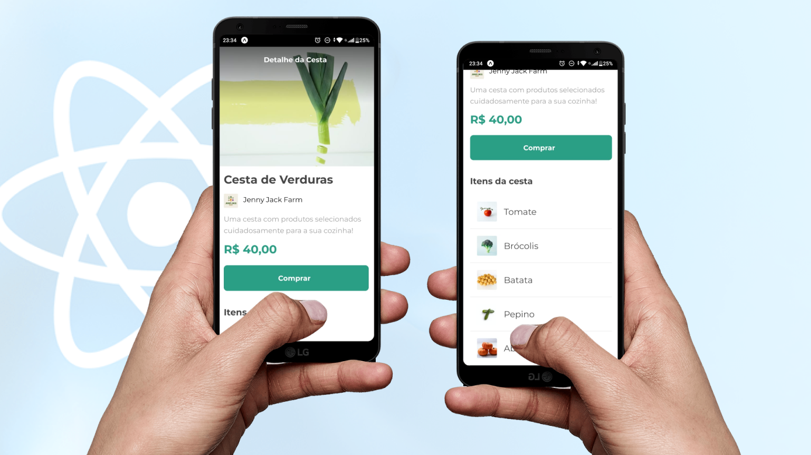

<h1 align="center"> Orgs Cesta :: React Native App </h1>

<p align="center">
  Projeto básico feito com React Native + Expo Go para treinamento e prática de programação front end de apps nativos em  Javascript.
  <br />
  Feito através da Trilha de Formação Dev Alura.
</p>

<br>

<p align="center">
  
</p>
<br />

## 🚀 Tecnologias

Esse projeto foi desenvolvido com as seguintes tecnologias:

- [React Native](https://reactnative.dev/)
- [Expo Go](https://expo.dev/)

<br />

<h1 align="center"> Setup Front-end</h1>

## 🔥 Front-end

Instale as dependências do projeto:

```
npm install
```

Rode a aplicação:

```
npm expo start
```

<br /><br /><br />

<h1 align="center"> Curso e Certificação</h1>

## 💻 Curso React Native - Alura

- [Acesse o curso clicando aqui](https://cursos.alura.com.br/course/react-native-comecando-zero)
  <br /><br />

## 🚀 Certificado

<p align="center">
  
</p>

<h4 align="center">
 
  <br />
  Feito com ♥ no Ubuntu 22.04 LTS
</h1>
